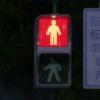

# 零杯设计文档
> '; DROP TABLE \*; -- 组

> RE. 从零开始的异世界前端开发生活

## 小组成员
```按用户名字典序排序```
-  [Akakii](https://blog.csdn.net/akak__ii)
-  [Exercisebook](https://lhr.wiki)
-  Sudocat
-  TYTY

## 温馨提示
- **使用HTTP/HTTPS协议浏览本项目以达到更好的观看体验** : [Github Page 传送门](https://exercisebook.github.io/Zeor_WebDesigningCompetition/)

## 网页主题
 - 印象珞珈

## 设计理念
 - 总体上使用清新，简洁的页面设计，给人一种既简单又不失内容，既清新又不缺风韵的视觉感受。我们从游——自然景致，食——美食诱惑，学——人文风情三方面，介绍我们心中的“最美大学”。

## 设计特点
 - 我们的网页整体以武大樱园建筑群为背景，以白色作为基础色调，秋季的金黄作为整体色调。从我们的设计构想来说，是通过整体的沉浸效果和多彩的丰富图片来给用户造成强烈的视觉冲击，使用户能够对武汉大学有一个整体的直观感受。

## 功能介绍
 - 看
 - 点赞啊，走过路过看过当然要点赞啊！武大125周年快乐！

 
## 开发文档

### 第三方支持库
 - 思源宋体 : <https://github.com/adobe-fonts/source-han-serif>
 - jQuery : <https://jquery.com/>
 - jQuery-cookie : <https://github.com/carhartl/jquery-cookie>
 - anime.js : <http://animejs.com/>
 - Kico Style : <https://works.paugram.com/style/>
 - wayou/audio-visualizer-with-controls : <https://github.com/wayou/audio-visualizer-with-controls>
 - loktar00/JQuery-Snowfall : <https://github.com/loktar00/JQuery-Snowfall>
 
### 背景音乐
 - FELT (NAGI☆) - inside 
	- http://feltmusic.net/FELT009/
	
### 图片资源
 -  一只格格不入的猪
 -  XIN
 -  syx
 -  庞七七
 
## 鸣谢
-  [luluxia 陆陆侠](https://llx.life/) 提供布局设计基础支持